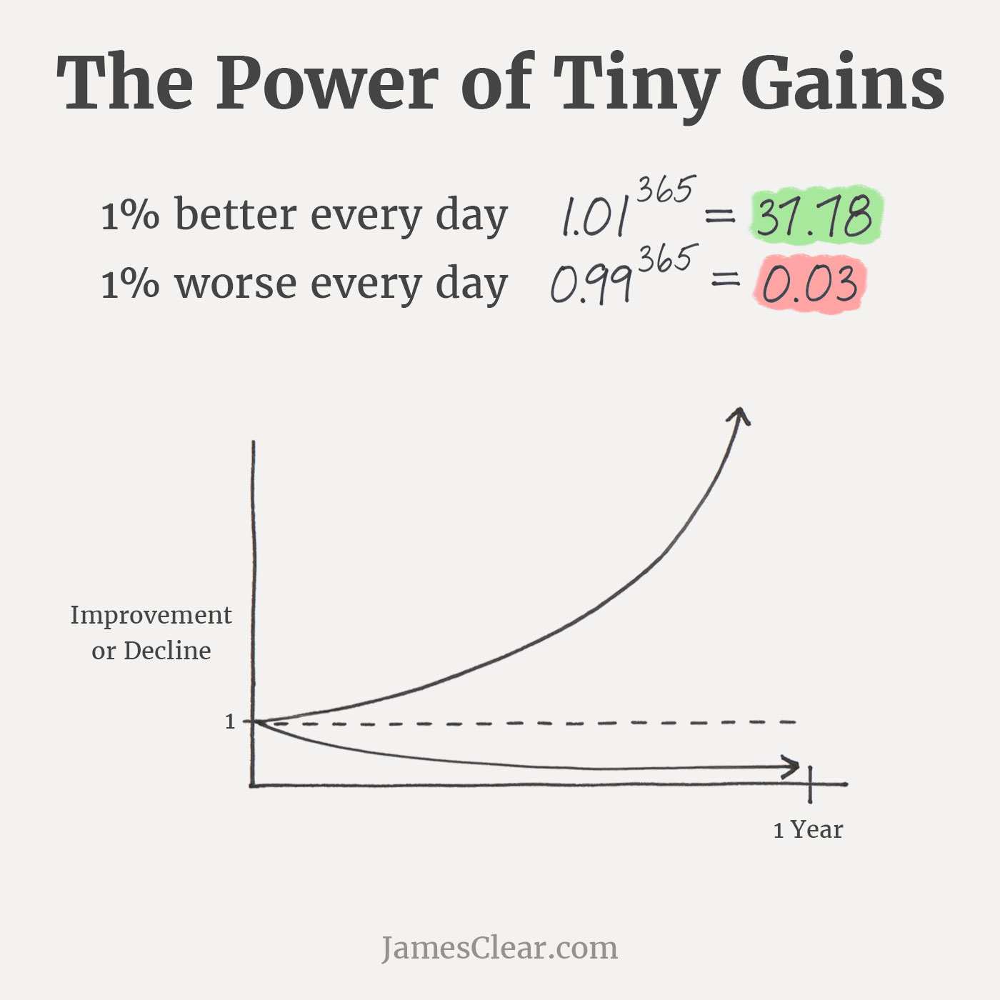

# No matter the topic, it's surpringly easy to learn
## Today is {{ site.time | date_to_string }} 
What would it take to be 1% better today? Picking up a single piece of garbage? Spending _5_ minutes on something you wanna learn? It doesn't take much but these tiny tiny gains can have massive effects over time. It can seem like a stretch to think picking up a single piece of trash or those 5 minutes changing anything at all. However, these actions accumulate fast. *James Clear* has an excellent diagram that depicts this growth:

{:refdef: style="text-align: center;"}
{: width="600" }
{: refdef}

